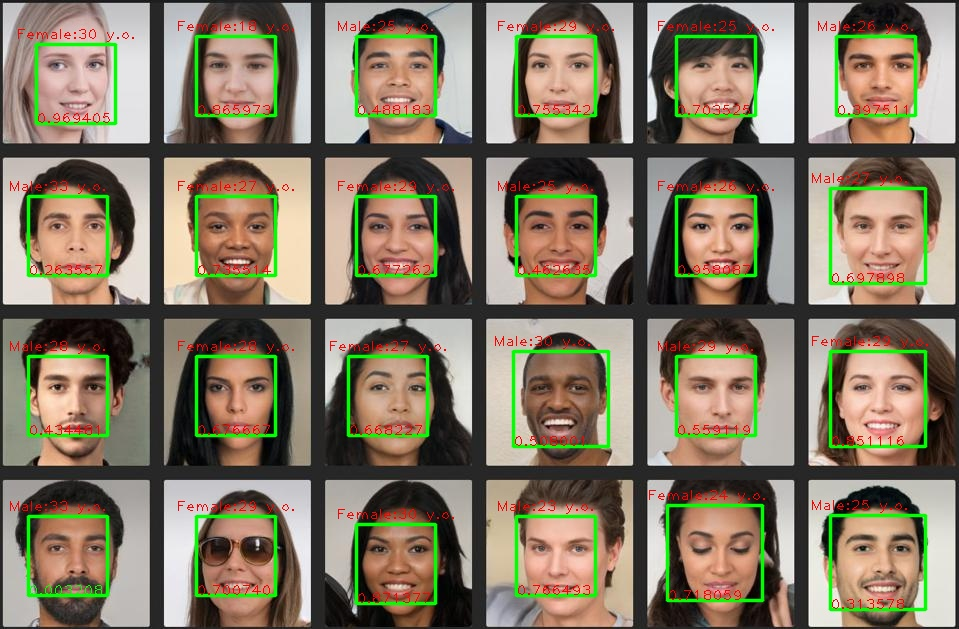

# go-face examples

## Requirements

To compile face you need to have [go-face](github.com/Danile71/go-face) and [gocv](gocv.io/x/gocv)



### Ubuntu:
```
1. cd models && ./download_models.sh
2. go build -tags gocv
3. ./face
```

### Mac m1:
```
1. cd models && ./download_models.sh
2. export LIBRARY_PATH=$LIBRARY_PATH:/opt/homebrew/lib
3. CPLUS_INCLUDE_PATH=/opt/homebrew/include go build -tags gocv
4. ./face
```
